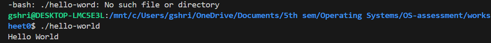
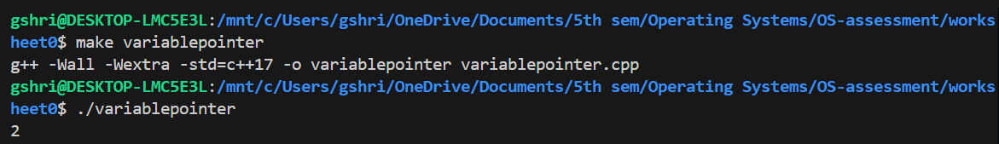
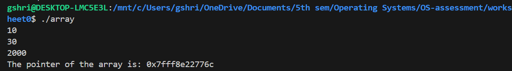
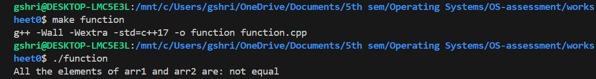
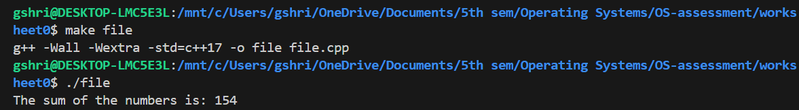
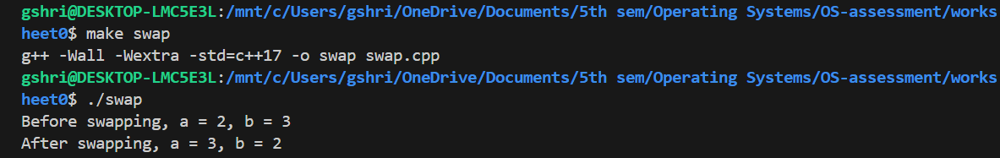
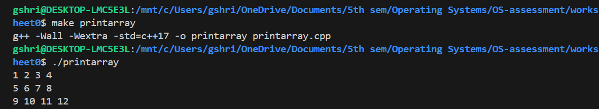

# Worksheet 0: An Echo of C++

## Module
UFCFWK-15-2 Operating Systems

## Description
This project contains solutions to the Worksheet 0 exercises:
1. Compiling a simple "Hello World" program
2. Basic pointers exercises
3. Array and pointer iteration
4. Pointer comparison function
5. Reading numbers from a file and summing
6. Swap function using void pointers
7. Printing 2D arrays using pointers

All tasks are implemented in C++ using Clang as the compiler.

---

## Project Structure

worksheet0/
│── hello-world.cpp
│── array.cpp
│── file.cpp
│── foo.txt
│── function.cpp
│── printarray.cpp
│── swap.cpp
│── variablepointer.cpp
│── Makefile
│── README.md
│── screenshots/
    ├── hello_build.png
    ├── pointers_run.png
    └── sum_file.png

---

## Compilation and Execution

### Build all programs together
To build the combined executable:
make

To run the combined program:
./worksheet0

---

### Build and run individual programs
To compile and run a single file, use its target name. For example:
make hello
./hello

### Clean up
To remove all object files and executables:
make clean
---

## Task Explanations and Screenshots

### 1. Hello World
- Simple program to test compilation.
- Outputs: `Hello World`

### 2. Pointer to local variable
- Created a pointer `ptr_to_n` to `int n`.
- Incremented value via pointer and printed result.

### 3. Array pointer iteration
- Created array `{10, 30, 2000}`.
- Used a pointer to loop through array and print each element and its address.

### 4. Pointer comparison function
- Function takes two pointers and a length.
- Returns `1` if arrays are identical, `0` otherwise.
- Tested in `main()`.

### 5. Sum numbers from file
- Reads integers from `foo.txt`.
- Prints sum of numbers.

### 6. Swap function
- Generic swap using `void*` pointers.
- Tested with integers and floats.

### 7. 2D array printing
- Function `print_array(int* arr, int width, int height)`.
- Prints array row by row using pointer arithmetic.

---

## Results
- All programs compile successfully using Clang.
- Pointer, array, file I/O, swap, and 2D array tasks work as expected.
- Worksheet tasks fully completed.

---

