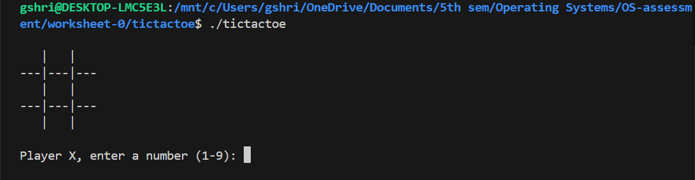
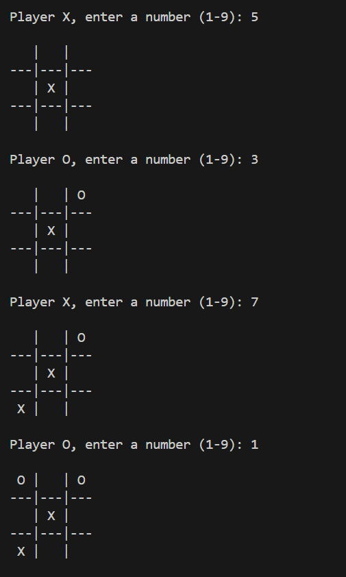
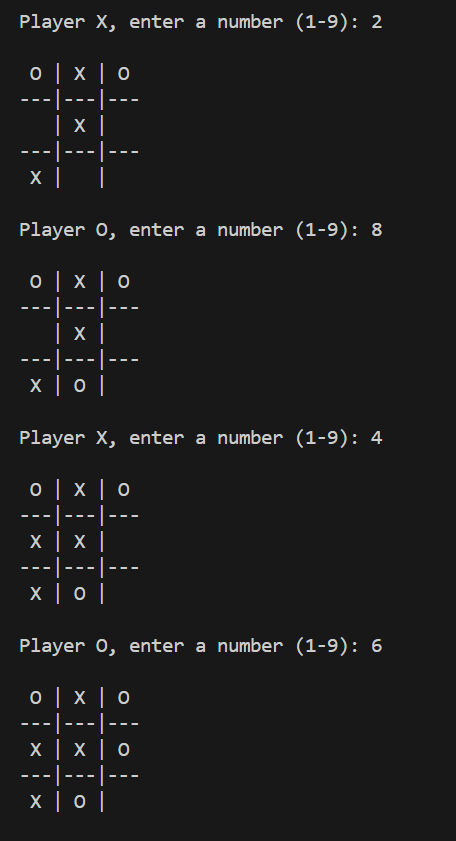
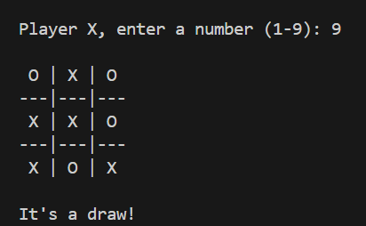

# TicTacToe Game in C

## Module
UFCFWK-15-2 Operating Systems

## Description
This project is a simple terminal-based TicTacToe game written in C.
It demonstrates:
- multiple source files (.c and .h)
- use of pointers
- compilation using a Makefile with separate compilation

The game is played by two players (X and O) in the terminal.

---

## Project Structure

tictactoe/
│── main.c
│── helpers.c
│── helpers.h
│── Makefile
│── README.md
│── screenshots/
    ├── gamestart.png
    ├── gameplay-1.png
    ├── gameplay-2.png
    └── gameresult.png

---

## File Descriptions
- main.c  
  Contains the main function and game loop.
- helpers.c  
  Contains the game logic such as printing the board, checking wins, and making moves.
- helpers.h  
  Header file with function declarations.
- Makefile  
  Used to compile the program using separate compilation.
- README.md  
  Project documentation.

---

## Compilation and Execution

Compile the program:
make

Run the game:
./tictactoe

Clean compiled files:
make clean

---

## How the Game Works
1. The board starts with numbers 1–9
2. Player X goes first
3. Players enter a number to place their symbol
4. The game checks for a win after each move
5. The game ends when a player wins or the board is full (draw)

---

## Use of Pointers

Pointers are used in the makeMove function to directly modify the board.

Example:
void makeMove(char *cell, char player) {
    *cell = player;
}

This function receives the address of a board cell and updates it using a pointer.

---

## Screenshots

### Initial Game Board

### During Gameplay

### Game Result

---

## Results
- Program compiles successfully using make
- Game runs correctly in the terminal
- Win and draw conditions work as expected
- Worksheet requirements are satisfied

---

## Conclusion
This project demonstrates a basic TicTacToe game using C while applying modular programming, pointers, and Makefiles, which are key Operating Systems concepts.

---